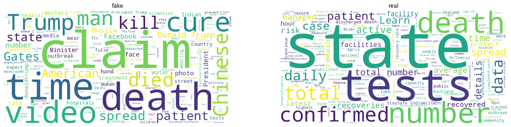
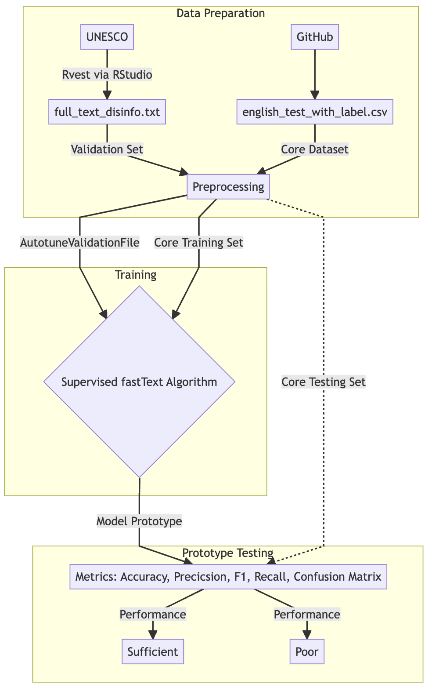
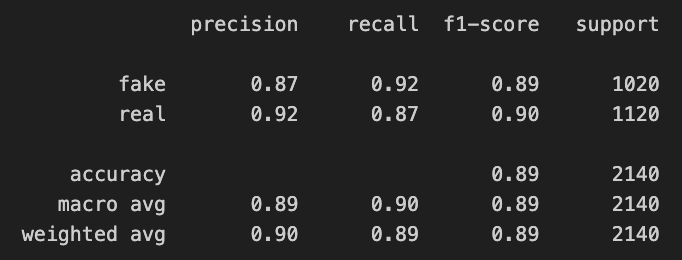
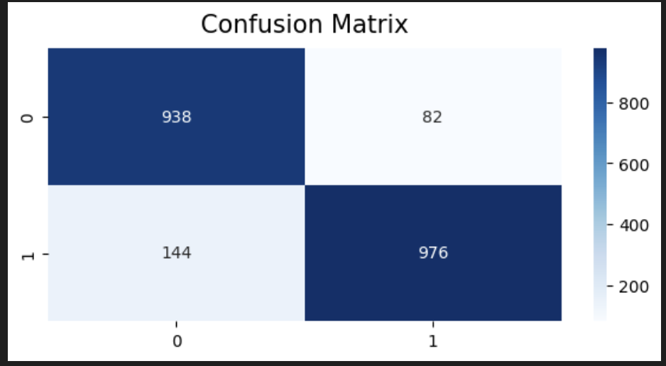

---
"Development, Analysis, and Demonstration of a Rudimentary fastText Classification Model for COVID-19 Misinformation"
---

# Introduction

Since its initial appearance in March 2020, the novel coronavirus has undeniably altered history.
Leading to over 7 million global casualties from 2020 to 2024, the virus and its resulting disease have become widely recognized topics of conversation.

The urgency surrounding the virus has generated countless narratives including but not limited to its symptomology, treatment, outcomes, and speculative origins.
Many of these narratives are validated by scientific investigation and propagated by authorized information channels (government, local, scientific, academic) on popular social media sites.

On the contrary, there exists a subsection of narrative that presents unsubstantiated information - often propagated through the same social networking outlets used by authorized entities.
These narratives are often based on unverified claims and false information about various aspects of COVID-19 and its causative agent.

The distribution and origins of COVID-19 misinformation are broad and thus difficult to fully classify.
However, American government intelligence suggests that parties involved in COVID-19 misinformation propagation are malicious non-state actors, governments, and organizations[^1].
Misinformation from these sources is often generated by automated processes (bots) and disseminated on Twitter, Facebook, Instagram, and other social media platforms.
Such misinformation content is often generated to instill chaos, mistrust, and confusion.
Other sources of misinformation are attributed to the internet presence of high-level politicians, celebrities, and other public figures[^2]
.

[^1]: Kavanagh, J., & Rich, M. D.
    (2021).
    **Truth Decay in the COVID-19 Pandemic: Exploring Sources and Impacts of Misinformation**.
    In S. J. Gentry & K.
    E. Boyce (Eds.), *Pandemics and the Crisis of Information* (pp. 115-136).
    Springer.
    https://doi.org/10.1007/978-3-030-73955-3_7

[^2]: Newman, N., Fletcher, R., Schulz, A., Andı, S., Robertson, C. T., & Nielsen, R. K.
    (2020).
    **Types, Sources, and Claims of COVID-19 Misinformation**.
    Reuters Institute for the Study of Journalism.
    Retrieved from <https://reutersinstitute.politics.ox.ac.uk/types-sources-and-claims-covid-19-misinformation>

There is general agreement that misinformation hinders public health progress and generates public confusion.
Additionally, there is an inverse relationship between the exponential increase of generated internet content and the collective ability to process it.
The loss of information literacy paired with colossal data generation brings a specific challenge to misinformation mitigation efforts.

An appropriate solution to mitigate misinformation spread is the application of machine learning methods (MLM) for online misinformation filtering.
Given the utility of MLM in handling large, live data - these methods can be employed to detect and filter out false information in real-time.

As machine learning becomes more advanced and accessible, it is of interest to explore text identification methods using MLM techniques such as natural language processing (NLP).
A particular MLM, fastText, is notable for its efficiency in this domain.

fastText is a popular NLP algorithm developed by formerly Facebook's AI Research Lab.
As well as showing success in text classification, fastText is notable for its ability to quickly process large datasets.
Its efficiency, scalability, and ease of use make it an ideal candidate for developing misinformation sentiment analysis tools.

In this analysis, fastText's capabilities are leveraged to develop a rudimentary text classification model trained on online COVID-19 Twitter content.
The ideal goal of the model development process is an effective demonstration of fastText's efficacy in labeling text as COVID-19 misinformation.

# Abstract

A fastText model is developed to label COVID-19 content as 'fake' or 'real' information.
The model is trained, tested, evaluated, and deployed on 4 pieces of selected COVID-19 related text content.
Customized preprocessing methods for misinformation-specific data are explored.

# Data Collection and Summary

**Core Dataset:**

The core dataset serves as the main dataset for training and testing the fastText model.
The original source can be found in the GitHub repository for ArXiv article '*Combating COVID-19 Misinformation on Social Media: A Scalable, Semisupervised Learning Approach*'.[^3]

[^3]: Github Repository: Sharma, K., Qian, F., Jiang, H., Ruchansky, N., Zhang, M., & Liu, Y.
    (2021).
    Combating COVID-19 Misinformation on Social Media: A Scalable, Semisupervised Learning Approach \[Code repository\].
    Retrieved from <https://github.com/diptamath/covid_fake_news>

The original dataset contains 3 columns with 2140 observations in total:

`id` `tweet` `label`

The training dataset consists of English-language tweets related to COVID-19.
The data was sourced from social media platforms and labeled with sentiment (positive, negative, neutral) and misinformation tags (real, fake).
The training data comprised tweets with corresponding labels, while a separate validation set was used for model tuning.
More information on the core dataset is available on its parent GitHub repository page.

**Validation Dataset:**

The validation set, used for autotuning fastText hyperparameters, is derived from a large UNESCO dataset on COVID-19 misinformation.[^4]

[^4]: UNESCO.
    (n.d.).
    ESOC COVID-19 Misinformation Dataset.
    Retrieved from <https://www.unesco.org/en/world-media-trends/esoc-covid-19-misinformation-dataset>

The source dataset contains 34 columns with 5645 observations in total.

| | `s_no`                   | | `Secondary_Country` |
| | `Source`                 | | `Primary_Country`   |
| | `Recoded_Main_Narrative` | | `Entry_Date`        |
| |  `Motive`                | | `Publication_Date`  |
| | `Motive_Description`     | | `Title`             |
| | `Reported_On`            | | `Direct_Post_4`     |
| | `Distrib_Channel`        | | `Direct_Post_3`     |
| | `Misinfo_Type`           | | `Direct_Post_2`     |
| | `Key_Words`              | | `Direct_Post_1`     |
| | `Summary` `Coder`        | | `Twitter_Reference` |
| | `Notes`                  | | `Retrieve_from_3`   |
| | `Secondary_Language`     | | `Retrieve_from_2`   |
| | `Primary_Language`       | | `Retrieve_from_1`   |
|                            | | `Region`            |

The misinformation itself was derived from the URLs listed in the `Reported_On` column.
Webpage content was scraped with Rvest in RStudio and compiled into `full_text_disinfo.txt`.
The derived dataset sourced text from 5645 URLs and yielded 1815376 characters and 268636 words total.

Because the fastText model weights are not affected by this data, labels were not required when setting the fastText `autotuneValidation` parameter.

## Pre-Processing

Stopword removal, label formatting, and character removal methods were embedded into a custom "clutter removal" function and applied to the core dataset.
Because fastText automatically tokenizes and vectorizes text, the techniques have been omitted from the preprocessing workflow. As a final preprocessing step, the core dataset was split into training and testing sets.
The testing set was created by methodically removing labels to hide true labels from the model. Labels were retained in the training set.

**Custom Stopword Removal** 
A customized list of stopwords was created and added to default *sklearn* stopwords. Custom stopwords are categorized as those present in all COVID-19 related content. The full list of topic-exclusive keywords can be found in this document’s code index. 
**Label Formatting**                                                                           
Each text entry was formatted to include an appropriate `__label__`prefix required by fastText. 
**Custom Character Removal**                                                                                                                     
Special characters such as “#”, “\@”, strings such as “https”, “t.co”, emojis, punctuation, and whitespace were removed to aid data readability.

# Model Training

The labeled and pre-processed core data were used to train the fastText model, sourced directly from the *fasttext* Python library.

## Hyperparameter Selection

The 'autotune' feature of fastText was included to optimize hyperparameters.
This feature employs an external validation file for hyperparameter tuning.
The tuning duration parameter was manually set to 20 seconds.
The label parameter was manually set for the model to better identify text entries with the `__label__` prefix.

# Evaluation

Evaluation was performed by applying testing data to the model prototype shortly after training.
The models' performance was evaluated with the following classification metrics: precision, accuracy, recall, F1-score.
A confusion matrix was generated to visualize the distribution of true positive, true negative, false positive, and false negative classifications.

# Results

The model classification metrics show an accuracy of \~0.89-0.90.
Precision scores for labels "fake" and "real" are 0.87, 0.92 respectively.
The model indicates strong performance in classifying the sentiment of tweets related to COVID-19 but does show a tendency in mislabeling "fake" text as "real".

**Label Prediction Demonstration Results**

The model correctly labeled 4 of 4 text inputs.
See Code Index for label prediction details.

# Conclusion

This analysis demonstrates the potential of fastText in the classification of COVID-19 misinformation.
By accurately classifying sentiment, this tool can help identify, label, and mitigate the spread of false information on social media platforms.
The simplicity of this tool also provides a useful introduction to machine learning application in misinformation classification.

# Discussion & Limitations

The results indicate that the fastText model is moderately effective in classifying misinformation sentiment in text related to COVID-19.
The preprocessing steps, particularly the custom stopword removal, were significant to the model's accuracy score.
This approach can be extended to other misinformation topics where sentiment is dependent on topic-specific keywords.

## Limitations of the Analysis:

1.  **Validation Data Source**: It is not known to what extent the validation dataset influences model optimization.
    The webpage content in question was derived from URLs that link to sources that reported on the source of misinformation.
    The content was not directly derived from misinformation content and contained text written in languages other than English.
    It is possible that model performance can be improved by sourcing from direct misinformation content links in the validation set.
    Additionally, content should contain information written in the English language.

2.  **Low Observation Size of Testing and Training Data**: The size of the training and testing data is relatively small in comparison to the validation set.
    The model's ability to classify text labels could be improved with the inclusion of larger training and testing datasets.

3.  **Low Number of Testing Iterations**: The number of testing iterations was limited to one for the brevity of this analysis.
    Model performance could be improved and further examined by increasing the number of testing iterations and accompanied testing datasets.

4.  **Uniform Training Data Source**: Because the model was trained only on content derived from Twitter, there may be a knowledge gap in the model's corpus.
    When applied to classification on content outside of Twitter, the model may show inconsistent prediction power.

5.  **Homogenous Testing and Training Data**: The model's performance may have been compromised by uniformity in the testing and training data.
    Both the testing and training data are identical except for the absence of labels in the training split.

6.  **Low Number of Prediction Capacity Demonstrations**: This analysis included 4 demonstrations of the model's predictive capacity.
    The 4 demonstrations are indicative of performance, but not conclusive.
    Performing more predictions can finalize the model's true prediction power.

# Future Direction

As stated in the limitations, the model can be further evaluated with the addition of larger and heterogeneous training and testing data, a more specific validation dataset, and increased testing iterations for the model.
Including misinformation data from sources other than Twitter in training data can aid in the model's prediction capacity.
Furthermore, the true classification power of this model can be assessed with further label prediction trials.
